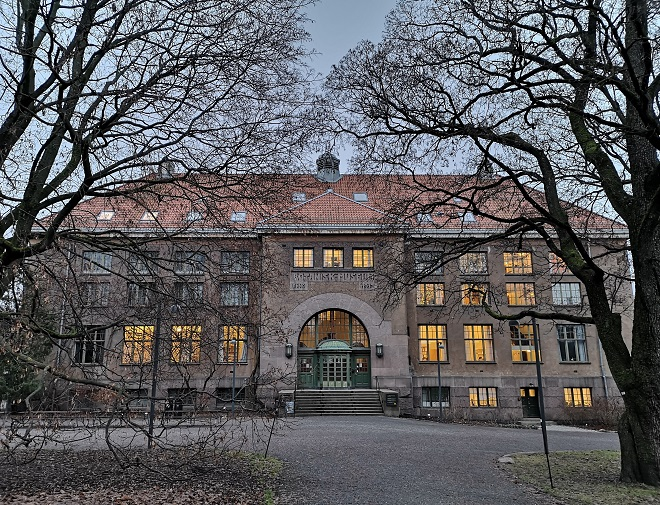

I'm a phd student at the Natural History Museum in Oslo, Norway. This page is made from my [GitHub account](https://github.com/evalieungh), which I use for some projects. 

Here are some links that describe my professional side:

- [NHM employee page](https://www.nhm.uio.no/english/about/organization/research-collections/people/evaler/index.html)
- [Publications](https://app.cristin.no/persons/show.jsf?id=885740)
- [LinkedIn](https://no.linkedin.com/in/evalieungh)
- [OrcID](https://orcid.org/0000-0003-4009-944X)
- [Mastodon](https://mstdn.science/@evalieungh)

